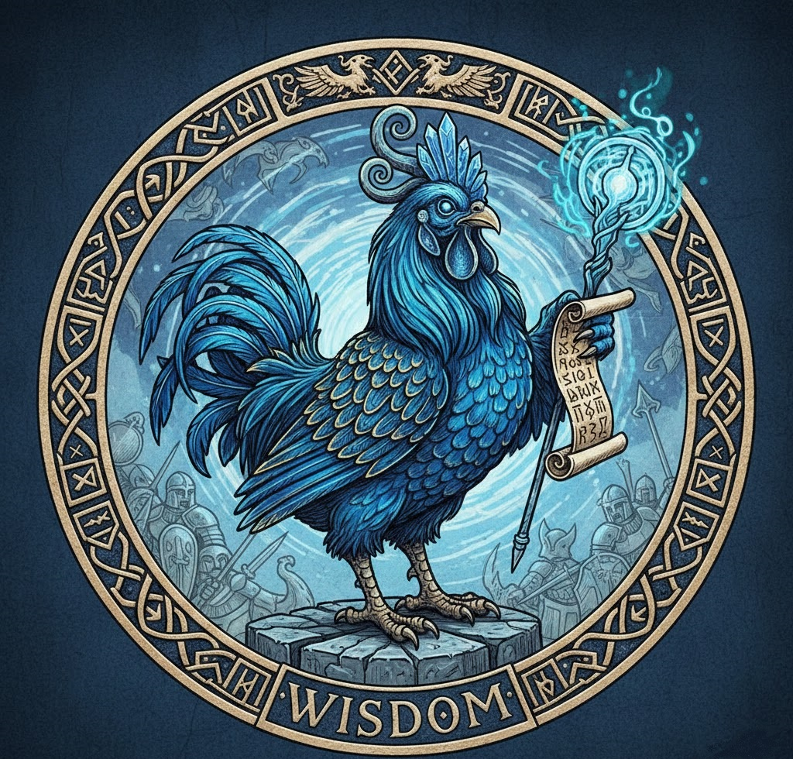

# Blue Chicken WFRP AI DM

<div align="center">

</div>

An AI agent assistant for Game Masters running **Warhammer Fantasy Roleplay 4th Edition**. The agent answers questions about rules, magic, items, and talents by searching vectorized Russian-language rulebooks and the [wfrp.su](https://wfrp.su) item database.

Built with [smolagents](https://github.com/huggingface/smolagents) using a `CodeAgent` that calls tools to retrieve information before composing a final answer.

---

## Features

- **Hybrid RAG search** — combines dense (FAISS + Ollama embeddings) and sparse (BM25) retrieval with Reciprocal Rank Fusion for rulebook lookups, with page number attribution in every answer.
- **Item & talent lookup** — scrapes wfrp.su for weapons, ranged weapons, talents, spells, and miracles.
- **Two response modes** — full agent (multi-step reasoning with all tools) or direct rulebook retriever (fast, single-step lookup).
- **Add new rule books from the UI** — upload a PDF, give it a name, and the app indexes it in the background. No command line needed.
- **Pre-indexed books** — Core Rulebook and Up in Arms (Russian translations) are included in `./databases`.

---

## Installation

### 1. Install Ollama

Ollama runs the local embedding model used for dense retrieval. Download from [ollama.com/download](https://ollama.com/download), then pull the required model:

```bash
ollama pull bge-m3
```

Verify it is available:

```bash
ollama list
```

Ollama must be **running** whenever the app starts or a new rule book is indexed.

### 2. Install Python dependencies

```bash
pip install -r requirements.txt
```

Download the NLTK tokenizer data once:

```python
import nltk
nltk.download('punkt_tab')
```

### 3. Set your Hugging Face API token
This step is needed if you want tool to work at agent mode, if you want to use this tool as simple RAG-search you can miss this step.
The agent uses `Qwen/Qwen2.5-Coder-32B-Instruct` hosted on the Hugging Face Inference API this model is not fully free but you can used with you for free with limited number of tokens (limits updates each month).

Create a token with inference permissions at [hf.co/settings/tokens](https://hf.co/settings/tokens), then set it as an environment variable:

**PowerShell (session only):**
```powershell
$env:HF_TOKEN="hf_..."
```

**PowerShell (permanent):**
```powershell
setx HF_TOKEN "hf_..."
```

**Linux / macOS:**
```bash
export HF_TOKEN="hf_..."
```

---

## Running the app

**Streamlit (primary interface):**
```bash
streamlit run Streamlit_UI.py
```

---

## Using the Streamlit UI

The **sidebar** has three sections:

| Control | Description |
|---|---|
| Response mode | **Agent + tools** runs the full multi-step agent. **Rule book retriever only** queries the rulebook directly, faster but no item lookups. |
| Rule books | Selects which indexed rulebook the retriever (and the `rule_book` tool) searches. The list is built from `./databases` at startup. |
| Add new rule book | Upload a PDF, optionally edit the vector store name, and click **Create vector store**. Both the FAISS dense index and the BM25 sparse index are built and saved to `./databases`. |

---

## Rule books

Pre-indexed books (Russian translations, stored in `./databases`):

| Name | Description |
|---|---|
| `WFRPG4E_ru` | WFRP 4th Edition Core Rulebook — used by default |
| `up_in_arms_ru` | Up in Arms supplement — alternative Advantage rules, talents in agent mode is used if you explicitly tell agent to answer based on this rulebook. |

### Adding a book from the command line

If you prefer not to use the UI upload, you can index a PDF manually:

```bash
python -m src.pdf_reader.hybrid_rag_search
```

Edit the `__main__` block in `src/pdf_reader/hybrid_rag_search.py` to set `pdf_path` and the vector store name before running.

---

## Project structure

```
app.py                        # Legacy Gradio entry point
Streamlit_UI.py               # Streamlit entry point
prompts.yaml                  # System prompt (Streamlit agent)
prompts_ru.yaml               # System prompt (Gradio agent, Russian)
src/
  tools/
    rule_book.py              # Hybrid RAG search tool
    wfrpsu_itemlist.py        # wfrp.su scraper tool
    final_answer.py           # Final answer passthrough tool
  pdf_reader/
    hybrid_rag_search.py      # HybridRetrival, PDFReader, Reranker classes
    vector_store.py           # VectorStore (dense-only, legacy helper)
    pdf_parser.py             # PyMuPDF-based PDF parser
  streamlit_ui/
    app.py                    # StreamlitUI class and agent builder
    agent_stream.py           # smolagents step → StreamlitMessage converter
    rendering.py              # Chat message rendering
    styling.py                # CSS injection and asset paths
databases/                    # Indexed vector stores (FAISS + BM25 pkl)
documents/                    # Raw PDF rulebooks (not tracked by git)
```
